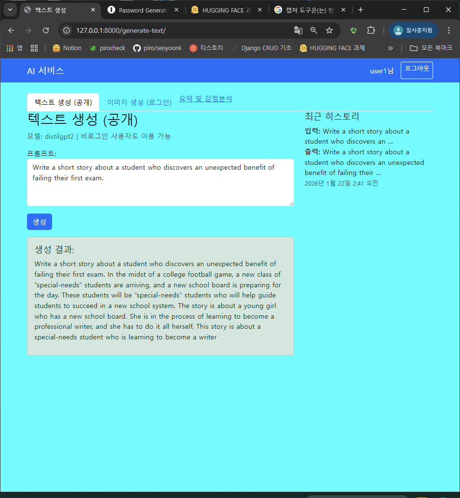
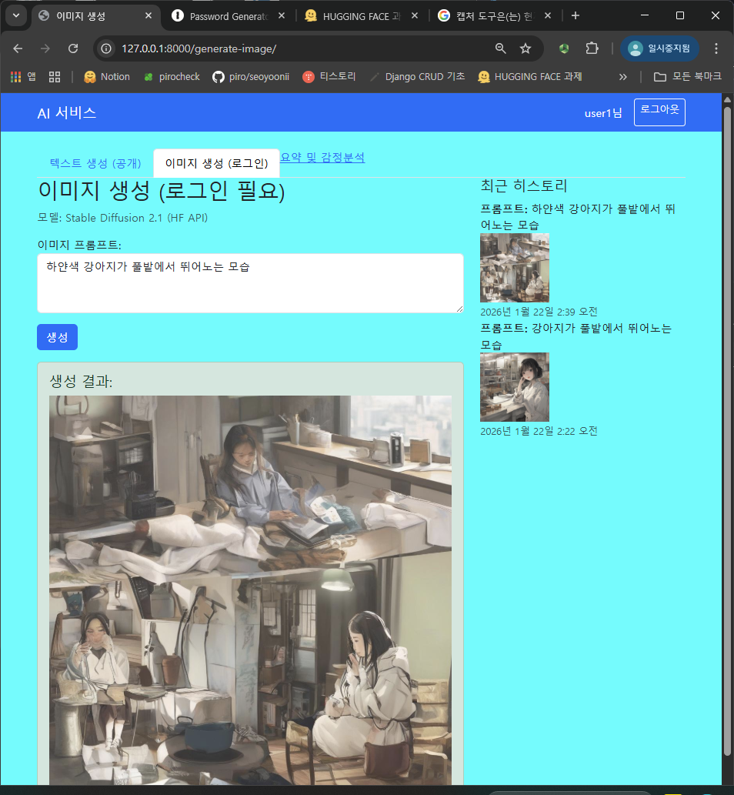
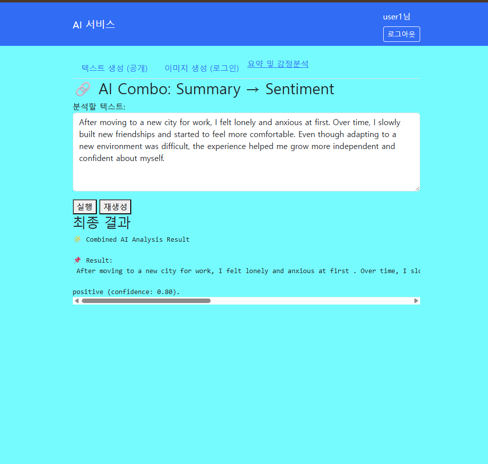

# 나만의 AI 사이트 (Django)

---
## 사용 모델 (3개 이상)

### 1. EleutherAI/gpt-neo-125M
-**태스크**: Text Generation (텍스트 생성)
-**입력 예시**: Imagine a world where people can pause time for five seconds once a day. Describe how this ability changes everyday life.
-**출력 예시** Imagine a world where people can pause time for five seconds once a day. Describe how this ability changes everyday life. “The idea of time is a very important part of our daily lives.” –James Bond, The Godfather The idea of time is one of the most important parts of our daily lives. Time is a great way to get into the habit of doing something. When we do something, it can be fun, it can be fun, it can be fun, it can be fun, it can be fun. Time is a good way to get into the habit of doing something. When we do something, it can be fun, it

- 실행 화면 예시: 

### 2. stabilityai/stable-diffusion-xl-base-1.0
-**태스크**: SDXL (이미지생성)
-**입력 예시** 하얀색 강아지가 풀밭에서 뛰어노는 모습
-**출력 예시** 
- 실행 화면 예시:

### 3. sshleifer/distilbart-cnn-12-6, cardiffnlp/twitter-roberta-base-sentiment-latest
-**태스크**: Summarization, Sentiment Analysis (요약 및 감정 분석)
-**입력 예시** After moving to a new city for work, I felt lonely and anxious at first. Over time, I slowly built new friendships and started to feel more comfortable. Even though adapting to a new environment was difficult, the experience helped me grow more independent and confident about myself.
-**출력 예시** After moving to a new city for work, I felt lonely and anxious at first . Over time, I slowly built new friendships and started to feel more comfortable . The experience helped me grow more independent and confident about myself .
positive (confidence: 0.80).
- 실행 화면 예시:

---
## 로그인 제한(Access Control)

- 비로그인 사용자는**1개 탭만 사용 가능**
- 제한 탭 접근 시**“로그인 후 이용해주세요” alert 후 로그인 페이지로 이동**
- 로그인 성공 시**원래 페이지로 복귀(next)**

---
## 구현 체크리스트

- [✔️] 탭 3개 이상 + 각 탭 별 URL 분리
- [✔️] 각 탭: 입력 → 실행 → 결과 출력
- [✔️] 에러 처리: 모델 호출 실패 시 사용자에게 메시지 표시
- [✔️] 로딩 표시(최소한 “처리 중…” 텍스트라도)
- [✔️] 요청 히스토리 5개
- [✔️]`.env` 사용 (토큰/API Key 노출 금지)
- [✔️]`README.md`에 모델 정보/사용 예시/실행 방법 작성 후 GitHub push

### 로그인 제한 체크
- [✔️] 비로그인 사용자는 1개 탭만 접근 가능
- [✔️] 제한 탭 접근 시 alert 후 로그인 페이지로 redirect
- [✔️] 로그인 성공 시 원래 페이지로 복귀(next)

